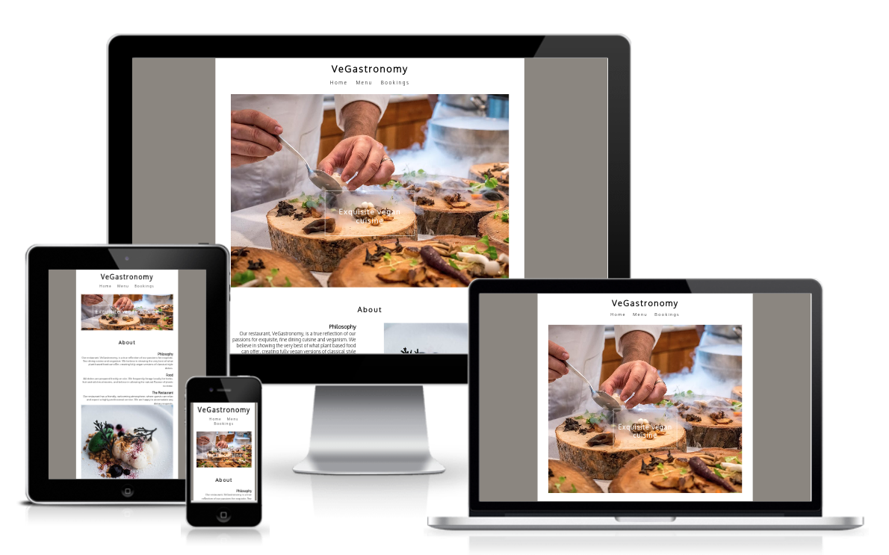

# VeGastronomy 
## ⚠️ARCHIVED PROJECT

**This is an archived project from my bootcamp with [Code Institute](https://codeinstitute.net) in 2022-2023, kept for historical reference. It does not represent my current skill level or tech stack.**

VeGastronomy is a fictional, fully plant-based, fine dining restaurant website built using HTML and CSS during my early learning phase. 

## Repository 
https://github.com/AlexSmall96/VeGastronomy
## Author 
Alex Small
# Credits
## Media
The photos used on the site were taken from [Pexels](https://www.pexels.com///)
## Code
Built using guidance from Code Institute materials and public CSS tutorials.

